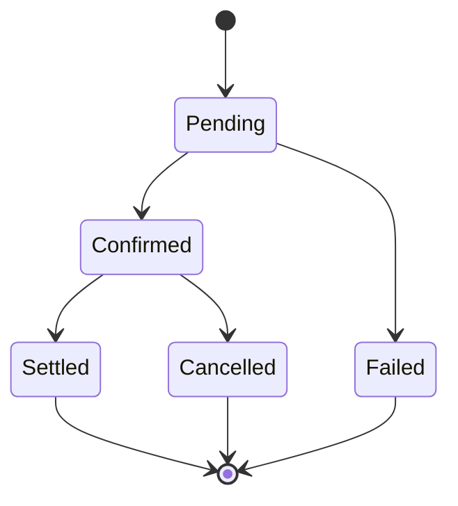

# CLAUDE.md

This file provides guidance to Claude Code (claude.ai/code) when working with code in this repository.

## Project Overview

**Game Aggregation Platform** — 游戏聚合平台
- **Stack**: .NET 10 (Backend) + React (Frontend) + Supabase (Database/Auth)
- **Mode**: Single Developer / Full AI Driven
- **Priority**: Financial Safety Level（资金安全级别）

## Core Priority（核心优先级 — 不可违反）

1. **资金安全** — 任何变更不得导致资金损失或不一致
2. **数据一致性** — 事务完整性，状态机合法性
3. **幂等控制** — 重复请求不得产生副作用
4. **可审计性** — 所有资金/状态变更必须有日志
5. 安全性 → 6. 性能 → 7. UI

> 任何开发不得破坏前 4 条。

## Build & Dev Commands

```bash
# Backend
dotnet restore
dotnet build
dotnet test
dotnet test --collect:"XPlat Code Coverage"  # 覆盖率 <85% 视为失败

# Frontend
npm install
npm run lint
npm run test
npm run build

# E2E
npx playwright test
```

## Architecture（强制分层）

```
Backend/
├── API/              # Controllers — 仅负责 HTTP 协议转换
├── Application/      # UseCases — 业务编排、DTO 转换
├── Domain/           # Entities + Business Rules — 纯逻辑，零依赖
└── Infrastructure/   # DB / Vendor API / Background Jobs
```

**禁止**：Controller 写业务逻辑 | 跨层直接访问数据库 | 直接修改余额字段

## Domain Rules（领域层强制规则）

- Domain 层不得依赖数据库、HTTP、缓存等外部基础设施
- Domain 方法必须是纯逻辑，无副作用
- 不允许在 Domain 层发送网络请求或访问 I/O
- 领域对象状态变更必须通过方法完成（行为驱动）
- 不允许外部直接修改 Entity 属性（使用 `private set`）
- Domain 层的依赖方向：仅依赖自身，被其他层依赖

## Central Wallet（中心钱包强制规则）

### 模型

| 实体 | 说明 |
|------|------|
| `Wallet` | 用户钱包，含版本号（并发控制）、冻结余额（提现冻结） |
| `WalletTransaction` | 流水记录，**不可删除** |

### 强制规则

- 所有金额使用 `decimal`，**禁止 float/double**
- 余额变动必须在数据库事务内完成
- 必须记录 `WalletTransaction` 流水
- 必须幂等校验（InternalOrderId / ExternalOrderId 唯一索引）
- 必须版本号 CAS 更新，**禁止直接 `UPDATE balance`**

### CAS 更新示例（乐观锁）

```sql
UPDATE "Wallets"
SET "Balance" = @newBalance,
    "FrozenBalance" = @newFrozenBalance,
    "Version" = @newVersion,
    "UpdatedAt" = @now
WHERE "Id" = @walletId
  AND "Version" = @expectedVersion;
-- 影响行数 = 0 表示版本冲突，必须重试或拒绝
-- 注意：使用绝对值更新（非增量），Domain 层计算新值后由 CAS 写入
```

### Balance Consistency Check（资金一致性校验）

- `Wallet.Balance` 必须等于 `SUM(WalletTransactions)` 汇总结果
- 必须提供后台一致性校验接口（管理员可触发）
- 必须有定期对账任务（BackgroundService），发现不一致时告警
- CI 不验证此项，但对账逻辑必须有单元测试覆盖

## Order State Machine（订单状态机）

所有三方订单必须映射为内部状态，单向流转：



合法状态：`Pending` | `Confirmed` | `Settled` | `Cancelled` | `Failed`

- 状态转换必须单向、可验证、可追溯
- 禁止出现未定义状态
- **必须在 Domain 层实现状态流转合法性验证**
- 非法流转（如 `Settled → Pending`）必须抛出异常
- 必须有状态流转单元测试覆盖所有合法路径和非法路径

## Vendor Integration（三方对接双模式）

支持两种模式，统一流程：

1. 创建 `Pending` 订单
2. **回调模式(A)** 或 **主动轮询模式(B)** 更新状态
3. 状态更新必须幂等
4. 必须防止重复结算

### 回调安全

- HMAC 签名验证 + 时间戳校验 + IP 白名单
- 原始 payload 存储到 `VendorCallbackLogs`
- 拒绝未验签请求

### 轮询规范

- 使用 `BackgroundService` 或 Hangfire
- **PendingOrderRecoveryService**：恢复卡在 `Pending` 状态的订单（转入失败/中断场景）
- **OrderPollingService**：轮询 `Confirmed` 状态订单（用户掉线/未主动退出游戏场景）
- 最大重试次数限制，禁止无限轮询
- 失败记录到 `VendorQueryLogs`，支持恢复

## Idempotency（幂等控制）

每个订单必须包含：

- `InternalOrderId` — 唯一（数据库唯一索引）
- `ExternalOrderId` — 唯一（数据库唯一索引）
- 处理前检查是否已完成
- 状态 CAS 更新

必须通过测试：重复回调 | 回调+轮询同时触发 | 重复 ExternalOrderId

## Concurrency Control（并发控制）

- 防止同一订单重复结算、并发余额更新错误
- 使用行级锁或版本号 CAS 更新
- 必须通过测试：10 次并发处理同一订单 | 版本号冲突 | 并发扣款

## Failure Recovery Strategy（异常恢复策略）

- 所有资金操作必须事务化，事务失败必须完整回滚
- 不允许部分成功（要么全部完成，要么全部回滚）
- 系统重启后，`Pending` 状态订单必须可被恢复任务自动拾起处理
- 恢复任务必须幂等，重复执行不产生副作用
- 异常中断场景必须有集成测试覆盖

## Alert Strategy（告警策略）

以下事件必须触发后台告警（邮件 / 后台通知 / SignalR 管理员频道）：

- 余额不一致（对账任务发现 `Wallet.Balance ≠ SUM(WalletTransactions)`）
- 重复结算（同一订单被处理多次）
- 回调签名验证失败
- 轮询超过最大重试次数仍未成功
- 版本号冲突频率异常（短时间内大量 CAS 失败）

告警必须记录到 `AdminActionLogs`，级别为 Error。

## Required Database Tables

| 表 | 用途 | 日志级别 |
|----|------|----------|
| `WalletTransactions` | 钱包流水（不可删除） | 必填流水 |
| `GameOrders` | 游戏订单 | Info / Error |
| `VendorCallbackLogs` | 回调日志（不可删除） | Info / Error |
| `VendorQueryLogs` | 轮询日志（不可删除） | Info / Error |
| `AdminActionLogs` | 后台操作日志（不可删除） | Info |

> 日志表不可物理删除，只能标记。Error 级别记录用于告警触发和问题排查。

## Database Migration Rules（数据库迁移规范）

- 所有结构变更必须通过 EF Core Migration，禁止手动修改生产数据库结构
- Migration 必须可回滚（提供 `Down` 方法）
- 禁止在 Migration 中删除含数据的列或表（先标记废弃，下个版本再清理）
- Migration 文件必须纳入版本控制

## Admin Panel（后台功能）

必须支持：用户查询 | 钱包流水查询 | 手动余额调整（必须生成流水）| 订单状态人工修改（必须记录日志）| 查看回调/轮询日志

## Real-time（实时推送）

使用 **SignalR**，仅用于：余额变动通知 | 提现状态 | 系统通知

**禁止**通过前端直接触发资金变动。

## Testing Requirements

### 单元测试（Domain 层覆盖率 ≥ 90%）

- 不依赖网络，Mock Vendor API
- 状态机：覆盖所有合法流转路径 + 所有非法流转路径（必须抛异常）
- 金额计算：边界值（0、负数、极大值）、decimal 精度
- 幂等逻辑：重复回调、轮询冲突、重复 ExternalOrderId
- 并发冲突：模拟 ≥10 并发请求处理同一订单
- 异常情况：事务回滚、版本号冲突、网络超时

### 集成测试

- 订单 → 钱包联动（创建订单后钱包余额正确变动）
- 回调流程（签名验证 → 状态更新 → 余额变动）
- 轮询流程（Pending 拾取 → 查询 → 状态更新）
- 人工干预流程（后台调整 → 流水生成 → 日志记录）
- 异常恢复任务（中断后 Pending 订单被自动恢复处理）

### E2E 测试（关键业务流程）

完整业务链路（Playwright）：

1. 用户登录
2. 用户充值 → 验证钱包余额变动
3. 创建游戏订单 → 调用游戏接口
4. 模拟回调/轮询 → 验证订单状态流转
5. 验证余额最终一致
6. 后台人工干预场景（手动调整余额、修改订单状态）
7. 验证所有操作产生审计日志

### 特殊测试（必须存在）

- 重复请求 | 并发测试 | 签名攻击 | 恢复一致性 | 重试机制

## CI Rules（GitHub Actions）

- 禁止直接 push main，PR 必须通过 CI，测试失败禁止合并
- Backend: restore → build → test → 覆盖率检查（<85% 失败）
- Frontend: install → lint → test → build
- E2E: 启动测试环境 → Playwright

## Bug Handling（资金相关 Bug 处理流程）

1. 判断是否影响余额
2. 检查是否重复结算
3. 更新测试覆盖
4. 修复代码
5. 确保幂等
6. CI 通过

## Time Handling Rules（时间处理规则）

- 所有时间使用**本地时间**，数据库存储为本地时间
- 禁止使用 `DateTime.UtcNow`，必须使用 `DateTime.Now` 或注入 `ITimeProvider`（返回本地时间）
- 时间比较必须统一时区，禁止混用本地时间和 UTC
- 回调时间戳校验、轮询间隔计算均基于本地时间

## Secrets & Security（敏感数据安全规则）

- 所有密钥/秘钥必须来自环境变量或 Secret Manager
- `.env` 文件禁止提交到仓库（必须在 `.gitignore` 中）
- 生产与测试环境必须完全隔离（不同数据库、不同密钥）
- 回调签名秘钥必须分厂商管理，禁止所有厂商共用同一秘钥

## Absolute Prohibitions（严禁事项）

- ❌ 跳过测试
- ❌ 绕过签名校验
- ❌ 直接修改余额（必须通过钱包服务）
- ❌ 删除流水/日志记录
- ❌ 硬编码密钥/秘钥
- ❌ 使用 float/double 表示金额
- ❌ 生成不可运行的代码片段

## AI Development Discipline（AI 开发模式约束）

- 每个新功能必须先输出设计说明，经确认后再编码
- 必须先写单元测试（TDD），再写实现
- 禁止一次性生成大量文件，每次只处理一个模块
- 生成代码后必须验证可编译、可运行
- 修改现有代码前必须先读取并理解当前实现
- 新增文件前必须检查是否已有相同功能文件，避免重复或覆盖
- 生成的代码必须符合 Backend/Frontend 分层结构，放入正确目录
- 生成的文件首行加标识注释：`// AUTO-GENERATED BY CLAUDE`

## Code Output Rules

输出代码必须：标明文件路径 | 标明新增或修改 | 给完整文件 | 可直接运行
